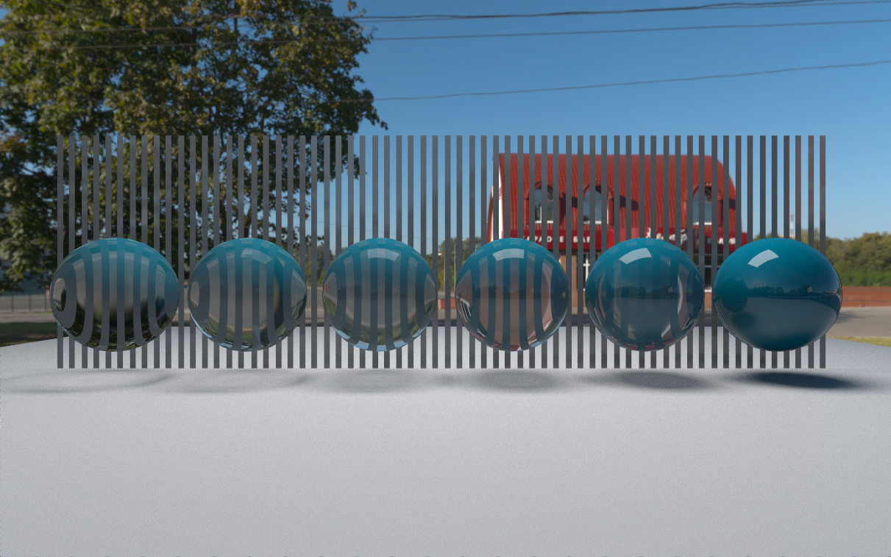
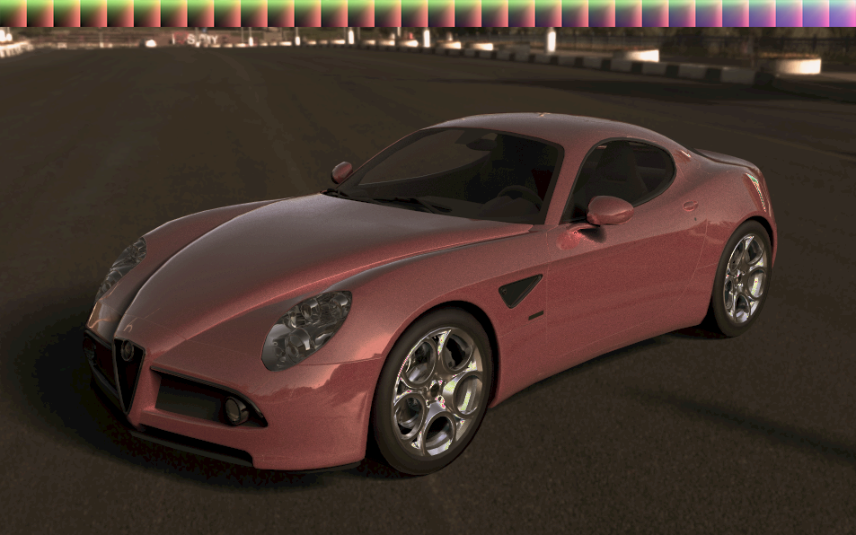

# unity-raytracing
GPU Raytracing renderer which runs in compute shader in unity.
This project is implemented by pure vertex shader, fragment shader and compute shader in Unity, not using any raytracing shaders.
## Features
- Whitted style path tracing
- Monte Carlo ray tracing
- Cosine Weighted sampling, Light importance sampling, BRDF importance sampling and Multiple importance sampling
- Physical Base Materials like plastic, metallic, clear coat, etc
- Split BVH acceleration structure by compute shader
- Complex triangle intersection
- PDF calculation based on importance sampling
- High quality soft shadow
- HDRI Environment Maps
- Depth of field
- Bloom
- Color correction and color grading

## Importance Sampling
### Uniform sampling

### Cosine weighted sampling

### Light sampling

### Cornell box

### Multiple importance sampling

## Physical Base Material
### Opaque spheres of increasing surface smoothness, metallic = 0

### Opaque spheres of increasing surface smoothness, metallic = 1

### Transparent  spheres of increasing surface smoothness, metallic = 0

### Transparent spheres of increasing IOR

### Opaque spheres of increasing IOR

### Transparent spheres becoming increasingly diffuse

## High Quality Soft Shadow
### Light radius = 0.01

### Light radius = 0.1

### Light radius = 0.5

## Realistic Car Rendering

## Post Processing Effect
### Color grading - You can do it

### Color grading - Bleach bypass

### Color grading - Candle light

### Color grading - Crisp warm.png

### Color grading - Urban cowboy

### Bloom

### Depth of Field
### Focal length = 1.15, lens radius = 0.1

### Focal length = 2.0, lens radius = 0.1

### Focal length = 2.0, lens radius = 0.3
